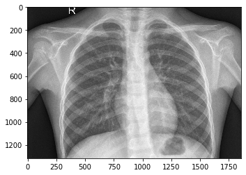
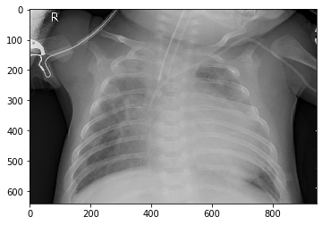

# Classify X-Ray Images with Convolutional Neural Network

## Problem Statement

The task at hand is to **classify diagnosis PNEUMONIA or NORMAL** using supervised machine learning method (CNN). Output layer is binary. Unfortunately, I couldn't put the images in the repository because the file size was too large. You can download the images from the [Kaggle](https://www.kaggle.com/paultimothymooney/chest-xray-pneumonia) webpage. After downloading, save the python file where the **chest_xray folder**.

### What is pneumonia?

Pneumonia is **swelling (inflammation) of the tissue** in one or both lungs. It's usually caused by a bacterial infection. It can also be caused by a virus, such as coronavirus (COVID-19).

### Who is affected by pneumonia?

Pneumonia can affect people of **any age**, but it's more common, and can be more serious, in certain groups of people, such as the **very young or the elderly**.

People in these groups are more likely to need hospital treatment if they develop pneumonia.

### What causes pneumonia?

Pneumonia is usually the result of a bacterial infection. As well as bacterial pneumonia, other types include:

-   **viral pneumonia** – caused by a virus, such as coronavirus.
-   **aspiration pneumonia** – caused by breathing in vomit, a foreign object, such as a peanut, or a harmful substance, such as smoke or a chemical.
-   **fungal pneumonia** – rare in the UK and more likely to affect people with a weakened immune system.
-   **hospital-acquired pneumonia** – pneumonia that develops in hospital while being treated for another condition or having an operation; people in  [intensive care](https://www.nhs.uk/conditions/intensive-care/) on breathing machines are particularly at risk of developing ventilator-associated pneumonia.

### Diagnosing pneumonia

A doctor may be able to diagnose pneumonia by asking about your symptoms and examining your chest. Further tests may be needed in some cases.

Pneumonia can be difficult to diagnose because it shares many symptoms with other conditions, such as the  [common cold](https://www.nhs.uk/conditions/common-cold/),  [bronchitis](https://www.nhs.uk/conditions/bronchitis/)  and  [asthma](https://www.nhs.uk/conditions/asthma/).

To help make a diagnosis, a doctor may ask you:

-   whether you feel breathless or you're breathing faster than usual
-   how long you have had your cough, and whether you're coughing up mucus and what colour it is
-   if the pain in your chest is worse when you breathe in or out

A doctor may also take your temperature and listen to your chest and back with a stethoscope to check for any crackling or rattling sounds.

They may also listen to your chest by tapping it. Lungs filled with fluid produce a different sound from normal healthy lungs.

If you have mild pneumonia, you probably will not need to have a chest  [**X-ray**](https://www.nhs.uk/conditions/x-ray/)  or any other tests.

You may need a chest X-ray or other tests, such as a sputum (mucus) test or  [blood tests](https://www.nhs.uk/conditions/blood-tests/), if your symptoms have not improved within 48 hours of starting treatment.

**Frequency: 450 million (7%) per year**

### Preventing pneumonia

Although most cases of pneumonia are bacterial and are not passed on from one person to another, ensuring good standards of hygiene will help prevent germs spreading.

For example, you should:

-   **cover your mouth and nose with a handkerchief or tissue when you cough or sneeze.**
-   **throw away used tissues immediately – germs can live for several hours after they leave your nose or mouth.**
-   **wash your hands regularly to avoid transferring germs to other people or objects.**

A healthy lifestyle can also help prevent pneumonia. For example, you should  [stop smoking](https://www.nhs.uk/live-well/quit-smoking/10-self-help-tips-to-stop-smoking/) as it damages your lungs and increases the chance of infection.

Excessive and prolonged [alcohol misuse](https://www.nhs.uk/conditions/alcohol-misuse/) also weakens your lungs' natural defences against infections, making you more vulnerable to pneumonia.

Sources: 

 - https://www.nhs.uk/conditions/pneumonia/
 -  https://en.wikipedia.org/wiki/Pneumonia

## Dataset

Dataset has 5216 images belonging to 2 classes in total. **test** folder has 624 X-Ray images, **train** folder has 5216 X-Ray images and **val** folder has 18 X-Ray images.

| Example of NORMAL Class X-Ray Image | Example of PNEUMONIA Class X-Ray Image |
|--|--|
|  |  |

## Methodology

Within the classification study; there are two different results, in other words, two different output layer results such as PNEUMONIA or NORMAL. Since the study was carried out with a binary dataset, the trained model was compiled with **binary_crossentropy** loss function.

For understanding the methodology you are free to visit the [CNN Explainer](https://poloclub.github.io/cnn-explainer/) website. 

Converting CNN keras model (classifier) to dot format and save to a file:

**Align center:**

     

val_accuracy:  **0.8845000267028809**

accuracy:  **0.82666665**

**Confusion Matrix**

| 1151 | 190 |
|--|--|
| **409** | **3466** |

Based on the trained model, predictions were made based on X-Ray photographs for the val file. 8  NORMAL class and 7 PNEUMONIA class X-Ray images used for the prediction . The results of the prediction can be seen in the following sequence.

***Prediction of NORMAL class:***
  
[[1.]]

[[0.]]

[[1.]]

[[1.]]

[[1.]]

[[1.]]

[[0.]]

[[0.]]

***Prediction of PNEUMONIA class:***

[[1.]]

[[1.]]

[[1.]]

[[1.]]

[[1.]]

[[1.]]

[[1.]]

***Took 250.25734400749207 seconds to classificate objects.***

## Contact Me

If you have something to say to me please contact me: 

 - Twitter: [Doguilmak](https://twitter.com/Doguilmak)  
 - Mail address: doguilmak@gmail.com
